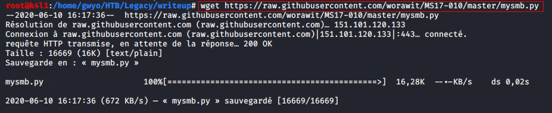

# Legacy

Aujourd'hui, commençons par une machine [HackTheBox](https://www.hackthebox.eu "Le site de Hack The Box") pour débutants par **ch4p**, Legacy.
Le site nous donne l'ip (**10.10.10.4**) et le type de système d'exploitation (**Windows**).

Connectons-nous au vpn puis lançons le scan pour découvrir les ports ouverts sur la machine.
J'ai pour habitude d'utiliser un petit script bash basé sur NMAP pour automatiser cette première étape.
Il scanne tout les ports TCP puis exécute la détection de l'OS et de version des services, les scripts basiques et un traceroute.

	echo "[+] Creating temporary folder..."
	if [ ! -d "temp" ];then
 	       mkdir temp
	fi
	printf " - OK!\n\n"
	echo "[+] Scanning all ports on $1..."
	nmap -T4 -p- $1 > ports.txt
	cat ports.txt | grep /tcp | cut -d '/' -f 1 > temp/ports
	printf " - DONE!\n\n"
	cat temp/ports | tr '\n' ',' | rev | cut -c 2- | rev > temp/format
	echo " => Ports found on host $1:"                                                                                
	cat ports.txt | grep /tcp                                                                                         
	printf "\n[+] Running nmap detection scripts..."                                                                  
	nmap -T4 -A -p$(cat temp/format) $1 > scan.txt                                                            
	printf " - DONE!\n\n"                                                                                             
	echo "[+] Removing temporary files..."                                                                            
	rm -rf temp                                                                                                       
	printf " - OK!\n\n"                                                                                               
	echo "[+] Result: scan.txt"

Nous faisons face à deux ports ouverts et un fermé.

Le scan nous révèle le nom de la machine (**Legacy**), du groupe de travail (**HTB**) et une autre information très importante:

Le système semble relativement ancien puisqu'il tourne sur **___Windows XP___**.

Voyons si nmap trouve des vulnérabilités connues sur ce service Samba d'un autre temps. Deux CVE (Commons Vulnerability Exposure) ressortent: 
- CVE-2008-4250 (ms08-067) NetApi DLL Exploit
- CVE-2017-0143 (ms17-010) EternalBlue

Double bingo !!! Nous pourrons exploiter ces failles RCE (Remote Code Execution) qui permettent à un attaquant d'exécuter du code à distance.

## MS08-067 ([CVE-2008-4250](https://www.cvedetails.com/cve/CVE-2008-4250)) NetAPI.dll Code Execution

Nous aurions pu utilisé Metasploit Framework pour découvrir quelques informations supplémentaires.

Et gagner un premier accès sur la machine...

... en tant que AUTHORITY/SYSTEM. Facile... Trop facile.

Pour le coup, avec Metasploit Framework, c'est vulnérable donc on attaque et ça marche !

Mais on n'en sait pas plus sur cette faille qui touche NetAPI32.dll.

Voyons ce qu'il y a dans la base de données Exploit-DB.

Il y a un script python qui ne semble pas correspondre à la version de notre machine cible.
Après quelques recherches, nous trouvons le même script amélioré sur le [GitHub de Andy Acer](https://github.com/andyacer/ms08_067/blob/master/ms08_067_2018.py) qui devrait faire l'affaire.

Et générons notre payload sous forme d'un reverse shell avec MsfVenom. Remplaçons le payload dans le script MS08-067.py par le nôtre. 

Depuis notre machine attaquante, on se prépare pour recevoir la connexion depuis notre cible.

Lançons notre exploit !

Et cette fois encore, nous avons un accès totale à la machine cible.

Intéressons-nous maintenant de plus près à la faille EternalBlue !

## MS17-010 ([CVE-2017-0143](https://www.cvedetails.com/cve/CVE-2017-0143)) "EternalBlue" SMB Remote Code Execution

Comme pour la faille précédente, Metasploit Framework est très efficace pour gagner un accès avec privilèges sur notre cible.

Cherchons la confirmation que la machine est bien vulnérable.

En quelques minutes, nous gagnons l'accès en tant qu'Administrateur.
Vérifions au passage si Metasploit a bien lancer une session avec un payload (ici Meterpreter) qui correspond à l'architecture de la cible.

Et on peut se lancer dans la post-exploitation. Un petit "hashdump", les flags user et root...

Du côté de Exploit-DB, ça ne semble toujours pas concerner notre machine sous Windows XP.

Heureusement, une recherche "__MS17-010 windows xp__" suffit pour trouver un script, toujours en python, [send_and_execute.py](https://github.com/helviojunior/MS17-010/blob/master/send_and_execute.py) sur le GitHub de Helvio Junior.
Son nom semble clair sur ce qu'il fait.

Nous aurons besoin d'un module pour notre script, MYSMB.

Ouvrons un port en écoute.

Créons un fichier éxecutable Windows avec MsfVenom. Envoyons-le et exécutons-le avec le script.

Cette fois encore, la session obtenue est root / admin de la machine...

Il est grand temps de hisser le pavillon noir, de récupérer nos flags et continuer de faire le tour de la machine.

